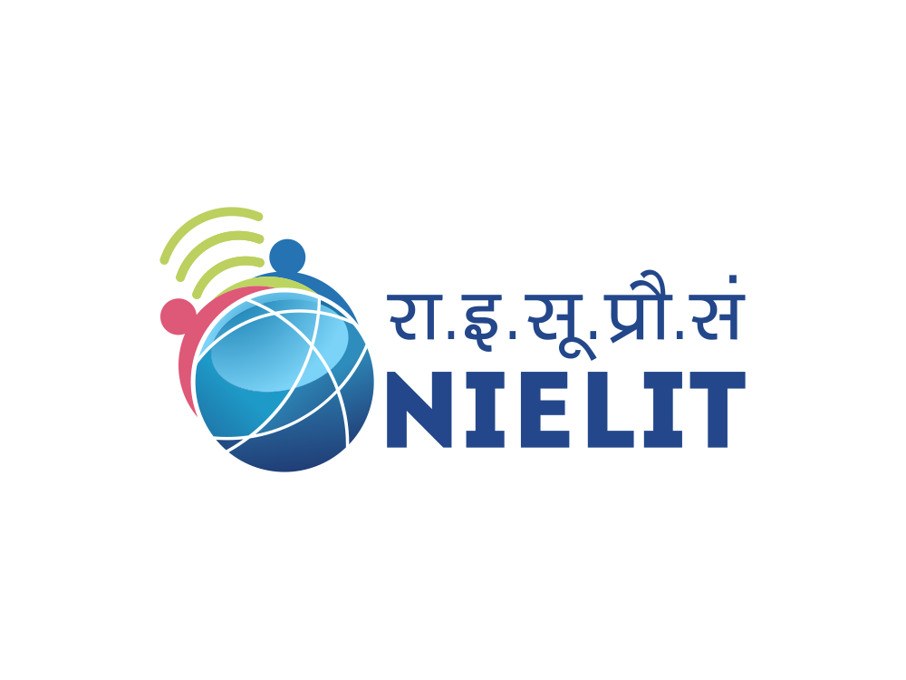

# WBL Corner — Web Page

This repository contains a simple web page for the WBL Corner project. Below are the two logos associated with this page.

  
  &nbsp;&nbsp;
  

Description: A minimal README showing the NIELIT and WBL logos for this web page.
Built by WBL Cohort 8.
# WBL Cohort 8 Site

Static one-page site for WBL Cohort 8 built from the official WBL/AICTE references and the provided intern assets.

## What is included

- Hero section with official programme context
- Cohort overview and schedule
- Featured intern cards with resume links
- Mentor / programme anchor section
- Gallery and resource links

## Local use

Open `index.html` directly in a browser, or serve the folder with any static server.

